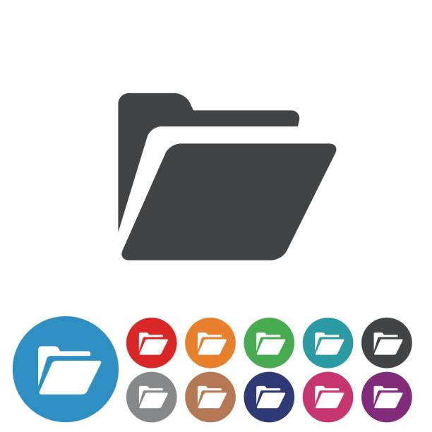

<a name="readme-top"></a>

<div align="center">
  
  <br/>
  <h1><b>Leaderboard</b></h1>
</div>

# 📗 Table of Contents

- [📗 Table of Contents](#-table-of-contents)
- [📖 Leaderboard ](#-leaderboard-)
  - [🛠 Built With ](#-built-with-)
    - [Tech Stack ](#tech-stack-)
    - [Key Features ](#key-features-)
  - [🚀 Live Demo ](#-live-demo-)
  - [🚀 Presentation ](#-presentation-)
  - [💻 Getting Started ](#-getting-started-)
    - [Prerequisites](#prerequisites)
    - [Setup](#setup)
    - [Install](#install)
    - [Usage](#usage)
  - [👥 Authors ](#-authors-)
  - [🔭 Future Features ](#-future-features-)
  - [🤝 Contributing ](#-contributing-)
  - [⭐️ Show your support ](#️-show-your-support-)
  - [❓ FAQ ](#-faq-)
  - [📝 License ](#-license-)


# 📖 Leaderboard <a name="about-project"></a>

This is a Leaderboard website, the project for the 4th block of the 2d module at Microverse.

## 🛠 Built With <a name="built-with"></a>

### Tech Stack <a name="tech-stack"></a>

<details>
  <summary>Text Editor</summary>
  <ul>
    <li><a href="https://code.visualstudio.com/">Visual Studio Code</a></li>
  </ul>
</details>

<details>
  <summary>Client</summary>
  <ul>
    <li><a href="https://html.com/">HTML</a></li>
    <li><a href="https://developer.mozilla.org/es/docs/Web/JavaScript">JavaScript</a></li>
  </ul>
</details>


<details>
  <summary>Style</summary>
  <ul>
    <li><a href="https://lenguajecss.com/">CSS</a></li>
  </ul>
</details>

<details>
  <summary>Bundle</summary>
  <ul>
    <li><a href="https://webpack.js.org/">Webpack</a></li>
  </ul>
</details>


### Key Features <a name="key-features"></a>

- **Add new name and score**
- **Submit Function (Button)**
- **Structural design**

<p align="right">(<a href="#readme-top">back to top</a>)</p>


## 🚀 Live Demo <a name="live-demo"></a>

<!-- Try it with <a href="https://mar12358.github.io/to-do-list/">gh-pages</a> -->
Coming Soon...

<p align="right">(<a href="#readme-top">back to top</a>)</p>

## 🚀 Presentation <a name="presentation"></a>

Coming Soon...

<p align="right">(<a href="#readme-top">back to top</a>)</p>


## 💻 Getting Started <a name="getting-started"></a>


### Prerequisites

Coming Soon...

### Setup

To clone this repository to your local machine, open a terminal and select desired folder:
```sh
  cd Leaderboard
```
Clone:
```sh
  git clone https://github.com/Mar12358/Leaderboard.git
```


### Install
N/A


### Usage
- To visualize the project, run:
```sh
  npm start
```


<p align="right">(<a href="#readme-top">back to top</a>)</p>

## 👥 Authors <a name="authors"></a>
<br>


👤 **Martín Ezequiel González**

- GitHub: [@Mar12358](https://github.com/Mar12358)
- Twitter: [@MarezegonZ](https://twitter.com/MarezegonZ)
- LinkedIn: [Martin Ezequiel Gonzalez](https://www.linkedin.com/in/martin-ezequiel-gonzalez-30a413260/)


<p align="right">(<a href="#readme-top">back to top</a>)</p>

## 🔭 Future Features <a name="future-features"></a>

- **Style**
- **Functions**
- **Deployment**


<p align="right">(<a href="#readme-top">back to top</a>)</p>

## 🤝 Contributing <a name="contributing"></a>

Contributions are welcome!

Feel free to check the [issues page](https://github.com/Mar12358/capstone-lh/issues).

<p align="right">(<a href="#readme-top">back to top</a>)</p>

## ⭐️ Show your support <a name="support"></a>
Nothing can stop success!

Give a ⭐️ if you like this project!

<p align="right">(<a href="#readme-top">back to top</a>)</p>

<p align="right">(<a href="#readme-top">back to top</a>)</p>

## ❓ FAQ <a name="faq"></a>


- **Are there such things as impossible things?**

  - ¡No! Only work to be done


<p align="right">(<a href="#readme-top">back to top</a>)</p>

## 📝 License <a name="license"></a>


This project is [MIT](./LICENSE) licensed.


<p align="right">(<a href="#readme-top">back to top</a>)</p>
